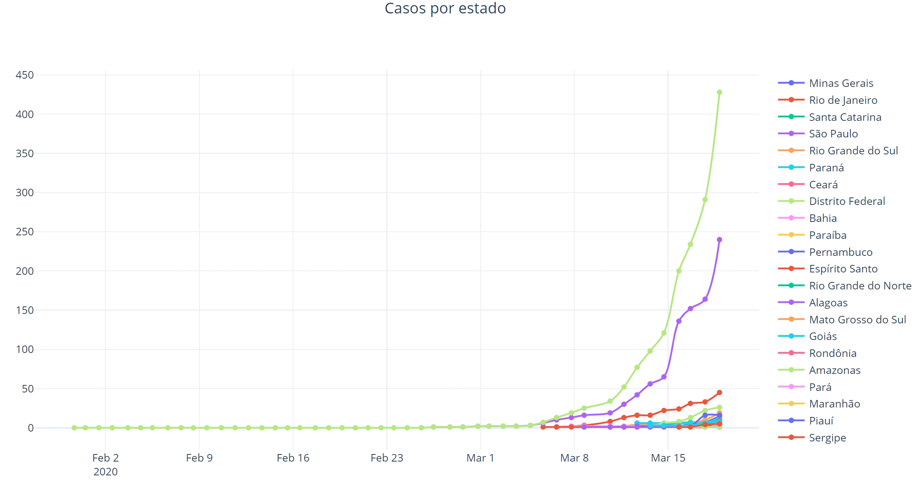

# [Deprecated since 20 Mar, 2020] Real-time charts for COVID-19 monitoring

Fast created COVID-19 monitoring dashboard as soon as the first cases happened in Brazil (for personal purpose).

Chart exemple:

https://gabrielalberton.github.io/COVID-dashboard/index.html

[Deprecated since 20 Mar, 2020] The Brazilian Ministry of Health interrupted the release of data in real time. The reason was not informed. Subsequently, [press vehicles came together](https://g1.globo.com/politica/noticia/2020/06/08/veiculos-de-comunicacao-formam-parceria-para-dar-transparencia-a-dados-de-covid-19.ghtml) to concatenate and disseminate the data. At this point, good initiatives already offered good dashboards for consultation, dispensing with the continuation of this repository.
